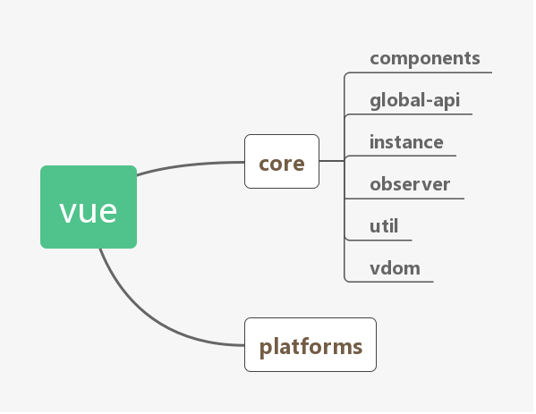
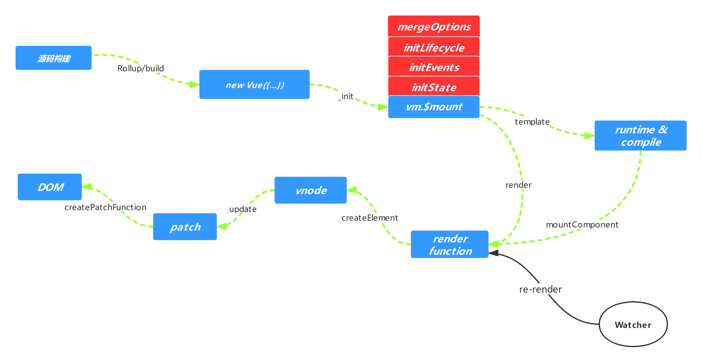

<h1 align="center">📖框架流程分析</h1>

vue 一直以简单，快速著称，也自称为渐进式框架今天我们来了解一下 vue 的源码，这样我们也能了解其中的思想，帮助我们在工作中很好的应用和解决问题。


## 源码架构

我们看一下 <a href="https://github.com/vuejs/vue">vue源码</a> 的核心目录方便大家去对应查找

``` md
src
├── compiler/        # 模版编译目录 
├── core/            # 核心代码 
├── platforms/       # 跨平台的支持
├── server/          # 处理服务端渲染
├── sfc/             # .vue 文件的解析
├── shared/          # 全局用到的工具函数
```

### compiler<hr>

vue 所有编译相关的代码。包括把模版解析成抽象语法树（AST）,编译、生成等功能

### core<hr>

vue 核心代码，包括内置组件，指令、全局API、Observer、虚拟DOM、全局工具函数等，这个目录也是vue的灵魂，也是我们重点关注分析的地方，compiler 会在后续文章中分析

###  platform<hr>

最初 vue 是跑在 web 上的mvvm架构, 后期增加了 阿里团队的 weex 入口，配合 weex 也可以运行在 native 客户端上

### server <hr>

服务端渲染入口，这是是vue2.0 之后更新的功能，所谓的服务端渲染是把相对应的组件渲染为服务端的 html 字符串，然后发送给客户端，客户端进行处理。这样做能提高客户体验

### sfc<hr>

将 .vue 文件内容解析成JavaScript的对象


## 源码构建

vue 源码是基于 <a href="https://rollupjs.org/guide/en/">Rollup </a>构建的，构建的配置在 scripts 目录下

``` md
scripts
├── git-hook/           # git-hook配置文件
├── alias               # 混入文件目录别名配置
├── build               # 构建的入口文件
├── config              # 构建全局配置文件
├── feature-flags       # weex 环境 flag
├── gen-release-note    # 生成 Change log
├── get-weex-version    # 生成 weexBaseVersion
├── release-weex        # weex发布的脚本
├── release             # 发布脚本
├── verify-commit-msg   # 检查 Commit message 是否符合格式
```

### 构建脚本<hr>

基于 npm 托管的项目都会有一个 package.json 文件，这个文件当中的 script 描述符中一般配置的基本都是启动项目、打包、测试等相关命令, 看一下 vue 项目根目录的 package.json,由于只做 build 环境中的分析，所以我们去掉 dev、test等执行命令

``` json
{
  "scripts": {
    "build": "node scripts/build.js",
    "build:ssr": "npm run build -- web-runtime-cjs,web-server-renderer",
    "build:weex": "npm run build -- weex",
  } 
}
```


上面三个命令在执行的时候通过环境参数来区分不同的平台，当执行 `npm run build` 命令的时候就会执行 `node scripts/build.js` 这个文件

### 构建过程<hr>

接下来来查看一下 `node scripts/build.js` 这个文件看看执行过程

```js
let builds = require('./config').getAllBuilds()
// filter builds via command line arg
if (process.argv[2]) {
  const filters = process.argv[2].split(',')
  builds = builds.filter(b => {
    return filters.some(f => b.output.file.indexOf(f) > -1 || b._name.indexOf(f) > -1)
  })
} else {
  // filter out weex builds by default
  builds = builds.filter(b => {
    return b.output.file.indexOf('weex') === -1
  })
}

build(builds)
// ...


```

通过上面的代码片段了解到主要引用了 `./config` getAllBuilds 文件下面的方法，进入这个文件

```js
const builds = {
  // ...

  const aliases = require('./alias')
  const resolve = p => {
    const base = p.split('/')[0]
    if (aliases[base]) {
      return path.resolve(aliases[base], p.slice(base.length + 1))
    } else {
      return path.resolve(__dirname, '../', p)
    }
  }


  // Runtime only (CommonJS). Used by bundlers e.g. Webpack & Browserify
  'web-runtime-cjs-prod': {
    entry: resolve('web/entry-runtime.js'),
    dest: resolve('dist/vue.runtime.common.prod.js'),
    format: 'cjs',
    env: 'production',
    banner
  },
  // runtime-only production build (Browser)
  'web-runtime-prod': {
    entry: resolve('web/entry-runtime.js'),
    dest: resolve('dist/vue.runtime.min.js'),
    format: 'umd',
    env: 'production',
    banner
  },
  // Runtime+compiler CommonJS build (CommonJS)
  'web-full-prod': {
    entry: resolve('web/entry-runtime-with-compiler.js'),
    dest: resolve('dist/vue.min.js'),
    format: 'umd',
    env: 'production',
    alias: { he: './entity-decoder' },
    banner
  },

  // ...
}

function genConfig (name) {
  const opts = builds[name]
  const config = {
    input: opts.entry,
    external: opts.external,
    plugins: [
      flow(),
      alias(Object.assign({}, aliases, opts.alias))
    ].concat(opts.plugins || []),
    output: {
      file: opts.dest,
      format: opts.format,
      banner: opts.banner,
      name: opts.moduleName || 'Vue'
    }
    // ...
  }
  // ...
  Object.defineProperty(config, '_name', {
    enumerable: false,
    value: name
  })
  return config

}

```

通过这里的代码片面大概了解到 vue 通过当前web、服务端渲染、webpack插件、weex等配置来进行打包，每一个配置都遵循 rollup 的构建规则

```json
{
  "entry": "构建的入口文件",
  "dest": "构建后的文件地址",
  "format": "构建规范",
  "alias": "别名设置" 
  // ...
}

```

那么在打包的过程中进行了路径别名设置，通过别名设置能代码能够更清晰整洁。

```js
const path = require('path')

const resolve = p => path.resolve(__dirname, '../', p)

module.exports = {
  vue: resolve('src/platforms/web/entry-runtime-with-compiler'),
  compiler: resolve('src/compiler'),
  core: resolve('src/core'),
  shared: resolve('src/shared'),
  web: resolve('src/platforms/web'),
  weex: resolve('src/platforms/weex'),
  server: resolve('src/server'),
  sfc: resolve('src/sfc')
}
```

看到这个别名设置，我们就应该很清楚 vue 的核心构建文件都在 src 目录，具体作用在文章开头就已经介绍过了。那么我们主要看 web 别名下的目录，其它的目录有兴趣的同学可以了解一下实现规则

```js
import Vue from 'core/index'
import config from 'core/config'
import { extend, noop } from 'shared/util'
import { mountComponent } from 'core/instance/lifecycle'
import { devtools, inBrowser } from 'core/util/index'

// ...

import { patch } from './patch'
import platformDirectives from './directives/index'
import platformComponents from './components/index'

// install platform runtime directives & components
extend(Vue.options.directives, platformDirectives)
extend(Vue.options.components, platformComponents)

// install platform patch function
Vue.prototype.__patch__ = inBrowser ? patch : noop

// public mount method
Vue.prototype.$mount = function (
  el?: string | Element,
  hydrating?: boolean
): Component {
  el = el && inBrowser ? query(el) : undefined
  return mountComponent(this, el, hydrating)
}

// ...

```

终于看到了 Vue 构造函数和核心代码的入口`core/index`，并在构造函数和原型上面挂载了一些方法，通过执行的上述构建过程我们总结到

Vue.js 的组成是由 core + 对应的 ‘平台’ 补充代码构成(独立构建和运行时构建 只是 platforms 下 web 平台的两种选择)

</img>


## new Vue


通过 vue 的核心目录，我们知道 Vue 实际上是一个构造函数，上面挂满了大大小小的各种方法我们在用的时候传一定的参数即可

```js
new Vue({
  el: 'xxxx',
  data: xxxx,
  ...
})
```

### initGlobalAPI<hr/>

那么在 vue 实例化的过程中到底发生了什么，打开核心代码 `src/core` 目录下面的 index


```js
src/core/index.js

// vue初始化的核心文件--创建Vue构造函数，将构造函数传入五个方法中
import Vue from './instance/index'
// 初始化全局API
import { initGlobalAPI } from './global-api/index'
// 获得一些环境判断，和是否是服务端渲染
import { isServerRendering } from 'core/util/env'
// ssr 环境加载此方法
import { FunctionalRenderContext } from 'core/vdom/create-functional-component'

//初始化全局API变量
initGlobalAPI(Vue)

//为vue的原型定义$isServer属性
Object.defineProperty(Vue.prototype, '$isServer', {
  get: isServerRendering
})

//为vue的原型定义$ssrContext
Object.defineProperty(Vue.prototype, '$ssrContext', {
  get () {
    /* istanbul ignore next */
    return this.$vnode && this.$vnode.ssrContext
  }
})

//为vue原型定义当为ssr环境时加载FunctionalRenderContext方法
Object.defineProperty(Vue, 'FunctionalRenderContext', {
  value: FunctionalRenderContext
})

//添加版本号
Vue.version = '__VERSION__'

export default Vue
```

总结一下这个文件加载的方法

```md

core/index
├── Vue            # 初始化构造函数
├── initGlobalAPI  # 初始化全局API
├── $isServer      # 判断环境的工具函数
├── $ssrContext    # ssr 环境加载此方法也可用于操作状态
├── FunctionalRenderContext  # ssr 环境加载此方法
├── 添加版本号
```
### new Vue <hr/>

初始化文件后，进入导出 Vue 构造函数的文件 `src/core/instance/index.js `

```js
function Vue (options) {
  if (process.env.NODE_ENV !== 'production' &&
    !(this instanceof Vue)
  ) {
    warn('Vue is a constructor and should be called with the `new` keyword')
  }
  this._init(options)
}
```

上面我们看到了 Vue 实际上就是一个用 Function 实现的类，通过 new 关键字初始化，然后会调用 this._init 方法。

```js
// ...
 Vue.prototype._init = function (options?: Object) {
    const vm: Component = this
    // a uid
    vm._uid = uid++

    let startTag, endTag
    /* istanbul ignore if */
    if (process.env.NODE_ENV !== 'production' && config.performance && mark) {
      startTag = `vue-perf-start:${vm._uid}`
      endTag = `vue-perf-end:${vm._uid}`
      mark(startTag)
    }

    // 如果是Vue的实例，则不需要被observe
    vm._isVue = true

    // 对参数进行 merge 操作  
    if (options && options._isComponent) {
      // optimize internal component instantiation
      // since dynamic options merging is pretty slow, and none of the
      // internal component options needs special treatment.
      initInternalComponent(vm, options)
    } else {
      vm.$options = mergeOptions(
        resolveConstructorOptions(vm.constructor),
        options || {},
        vm
      )
    }

    // 通过判断 Proxy 为 vue的实例属性赋值
    /* istanbul ignore else */
    if (process.env.NODE_ENV !== 'production') {
      initProxy(vm)
    } else {
      vm._renderProxy = vm
    }

    vm._self = vm

    // 初始化生命周期相关
    initLifecycle(vm)

    // 输初始化事件监听相关
    initEvents(vm)

    // 初始化编译render
    initRender(vm)

    // 调用beforeCreate钩子函数并且触发beforeCreate钩子事件
    callHook(vm, 'beforeCreate')

    initInjections(vm)

    // 初始化props、methods、data、computed与watch
    initState(vm)

    initProvide(vm)

    // 调用created钩子函数并且触发created钩子事件
    callHook(vm, 'created')


    /* istanbul ignore if */
    if (process.env.NODE_ENV !== 'production' && config.performance && mark) {
      // 格式化组件名
      vm._name = formatComponentName(vm, false)
      mark(endTag)
      measure(`vue ${vm._name} init`, startTag, endTag)
    }


    // 挂载组件方法触发组件的DOM渲染
    if (vm.$options.el) {
      vm.$mount(vm.$options.el)
    }
  }

// ...
```
通过上面代码的注释了解到 Vue 初始化主要就干了几件事情，合并配置操作，初始化生命周期，初始化事件监听，初始化render，初始化 data、props、computed、watcher 等，在最后调用vm.$mount 方法挂载 vm ，把模版渲染成DOM。当然这里面还有很多细节需要知道例如上面初始化合并配置，生命周期初始化等，会在后面清楚的梳理 vue 整理流程之后，进入细节

## vm.$mount

通过 $mount 实例方法去挂载 vm ，但 $mount 方法是由于多平台编译处理不太一样，所以在多个文件中定义。我们进入 `src/platform` 这个目录可以观察到有 web 和 weex 目录，我们直接抛掉 weex，只分析 web 目录，在 vue 官网教程中介绍了vue的完整版`web/entry-runtime-with-compiler.js`和runtime版本`web/runtime/index.js`

完整版

- 包含编译和运行是的版本
- html字符串 → render函数 → vnode → 真实dom节点

runtime版本

- 创建 Vue 实例、render、更新 DOM 等的操作的代码，没有编译器编译模版字符串代码
- render函数 → vnode → 真实dom节点


### 完整版 $mount<hr>

```js
// ...

const mount = Vue.prototype.$mount
Vue.prototype.$mount = function (
  el?: string | Element,
  hydrating?: boolean
): Component {
  el = el && query(el)

  /* istanbul ignore if */
  if (el === document.body || el === document.documentElement) {
    process.env.NODE_ENV !== 'production' && warn(
      `Do not mount Vue to <html> or <body> - mount to normal elements instead.`
    )
    return this
  }

  const options = this.$options
  // resolve template/el and convert to render function
  if (!options.render) {
    let template = options.template
    if (template) {
      if (typeof template === 'string') {
        if (template.charAt(0) === '#') {
          template = idToTemplate(template)
          /* istanbul ignore if */
          if (process.env.NODE_ENV !== 'production' && !template) {
            warn(
              `Template element not found or is empty: ${options.template}`,
              this
            )
          }
        }
      } else if (template.nodeType) {
        template = template.innerHTML
      } else {
        if (process.env.NODE_ENV !== 'production') {
          warn('invalid template option:' + template, this)
        }
        return this
      }
    } else if (el) {
      template = getOuterHTML(el)
    }
    if (template) {
      
      // ...
      const { render, staticRenderFns } = compileToFunctions(template, {
        outputSourceRange: process.env.NODE_ENV !== 'production',
        shouldDecodeNewlines,
        shouldDecodeNewlinesForHref,
        delimiters: options.delimiters,
        comments: options.comments
      }, this)
      options.render = render
      options.staticRenderFns = staticRenderFns

      // ..
    }
  }
  return mount.call(this, el, hydrating)
}

// ...
```

上面代码逻辑很清晰，将执行以下过程

- 首先在原型上定义了 $mount 这个方法
- 对传入的 el 做限制不能将节点挂载在 body 和 html 这种跟节点上
- 如果没有定义 render 方法，则会把 el 或者 template 字符串转换成 render 方法
- 模版或字符串转换 render 方法（调用 compileToFunctions 进行编译转换）


### runtime 版本 $mount<hr>

```js
// ...

// public mount method
Vue.prototype.$mount = function (
  el?: string | Element,
  hydrating?: boolean
): Component {
  el = el && inBrowser ? query(el) : undefined
  return mountComponent(this, el, hydrating)
}

// ...

```

执行过程
- 挂载的元素，可以是字符串，也可以是DOM对象，如果是字符串通过 query 方法转换成DOM
- 执行 mountComponent 函数传入三个参数
 
通过上面代码可以看出并没有经过 compileToFunctions方法 进行转换编译阶段，而直接是 render --> VNode 过程。

接下来我们接着查看 mountComponent方法调用，打开文件`src/core/instance/lifecycle.js`

```js
export function mountComponent (
  vm: Component,
  el: ?Element,
  hydrating?: boolean
): Component {
  vm.$el = el
  if (!vm.$options.render) {
    vm.$options.render = createEmptyVNode
    // ...
  }
  callHook(vm, 'beforeMount')

  let updateComponent
  
  // ...

  updateComponent = () => {
    vm._update(vm._render(), hydrating)
  }

  // ...

  // we set this to vm._watcher inside the watcher's constructor
  // since the watcher's initial patch may call $forceUpdate (e.g. inside child
  // component's mounted hook), which relies on vm._watcher being already defined
  new Watcher(vm, updateComponent, noop, {
    before () {
      if (vm._isMounted && !vm._isDestroyed) {
        callHook(vm, 'beforeUpdate')
      }
    }
  }, true /* isRenderWatcher */)
  hydrating = false

  // manually mounted instance, call mounted on self
  // mounted is called for render-created child components in its inserted hook
  if (vm.$vnode == null) {
    vm._isMounted = true
    callHook(vm, 'mounted')
  }
  return vm
}
```

通过上面代码很直观的看见 mountComponent 方法主要作用

- 判断 render 函数是不是存在如果不存在调用创建 createEmptyVNode 方法创建一个空VNode节点
- 检测完 render 开始挂载 beforeMount 钩子
- 执行 new Watcher方法()
- _isMounted状态设置true， 开始挂载mounted


Watcher 在它的回调函数中会调用 updateComponent 方法，在此方法中调用 vm._render 方法生成虚拟 Node节点，最后调用 vm._update 更新 DOM

Watcher 初始化的时候会执行回调函数，当 vm 实例中的监测的数据发生变化的时候也会执行回调函数，这就是我们说的观察者进行依赖收集的过程,当然这也是 vue 核心原理的一部分。new Watcher到底做了什么我们在后面的单独整理，先以主线程为主


## vm._render

上文中提到 Watcher 在它的回调函数中会调用 updateComponent 方法，在此方法中调用 vm._render 方法生成虚拟 Node节点，最后调用 vm._update 更新 DOM，那么就出现 私有方法 vm._render 和 vm._update 两个最核心的方法。
 
_render 定义在 `src/core/instance/render.js` 中

```js

  // ...
  Vue.prototype._render = function (): VNode {
    const vm: Component = this
    const { render, _parentVnode } = vm.$options

    if (_parentVnode) {
      vm.$scopedSlots = normalizeScopedSlots(
        _parentVnode.data.scopedSlots,
        vm.$slots,
        vm.$scopedSlots
      )
    }

    // set parent vnode. this allows render functions to have access
    // to the data on the placeholder node.
    vm.$vnode = _parentVnode
    // render self
    let vnode
    try {
      // There's no need to maintain a stack because all render fns are called
      // separately from one another. Nested component's render fns are called
      // when parent component is patched.
      currentRenderingInstance = vm
      vnode = render.call(vm._renderProxy, vm.$createElement)
    } catch (e) {
      handleError(e, vm, `render`)
      // return error render result,
      // or previous vnode to prevent render error causing blank component
      /* istanbul ignore else */
      if (process.env.NODE_ENV !== 'production' && vm.$options.renderError) {
        try {
          vnode = vm.$options.renderError.call(vm._renderProxy, vm.$createElement, e)
        } catch (e) {
          handleError(e, vm, `renderError`)
          vnode = vm._vnode
        }
      } else {
        vnode = vm._vnode
      }
    } finally {
      currentRenderingInstance = null
    }
    // if the returned array contains only a single node, allow it
    if (Array.isArray(vnode) && vnode.length === 1) {
      vnode = vnode[0]
    }
    // return empty vnode in case the render function errored out
    if (!(vnode instanceof VNode)) {
      if (process.env.NODE_ENV !== 'production' && Array.isArray(vnode)) {
        warn(
          'Multiple root nodes returned from render function. Render function ' +
          'should return a single root node.',
          vm
        )
      }
      vnode = createEmptyVNode()
    }
    // set parent
    vnode.parent = _parentVnode
    return vnode
  }
```


上面这段代码最关键的地方就是调用 render 方法 `render.call(vm._renderProxy, vm.$createElement)`，在上面说过在 mounted 方法中会把 template 和 string 经过 compileToFunctions 编译最后形成 render方法进行渲染，但是这是用字符串模版的形式，如果用字符串模板的代替方案 render 方法呢


```js
new Vue({
  render: function (createElement) {
   return createElement('div', {
     attrs: {
        id: 'app'
      },
  }, this.message)
  },
  renderError: function(createElement, err) {
    return createElement('pre', { style: { color: 'red' }}, err.stack)
  }
}).$mount('#app')
```

我们可以看出render 方法的参数 createElement 实际上就是 vm.$createElement,然而 vm.$createElement 在初始化中就已经执行过了

```js
export function initRender (vm: Component) {
  
  // ...

  vm._c = (a, b, c, d) => createElement(vm, a, b, c, d, false)
  // normalization is always applied for the public version, used in
  // user-written render functions.
  vm.$createElement = (a, b, c, d) => createElement(vm, a, b, c, d, true)

  // $attrs & $listeners are exposed for easier HOC creation.
  // they need to be reactive so that HOCs using them are always updated
  const parentData = parentVnode && parentVnode.data

  // ...

}
```

所以在 initRender 方法的时候，除了 vm.$createElement 方法，还有一个 vm._c 方法，它是被模板编译成的 render 函数使用，但 vm.$createElement 是我们用原生写的 render 方法使用的， 这俩个方法支持的参数相同，并且内部都调用了 createElement 方法。

官网中一句话说的很清楚 **Vue 选项中的 render 函数若存在，则 Vue 构造函数不会从 template 选项或通过 el 选项指定的挂载元素中提取出的 HTML 模板编译渲染函数。**

通过上述总结到 render 函数最终是执行 createElement 方法 返回 vnode 节点，这是一个虚拟 node 而 vue2.0 的 另一个核心就是利用了Virtual DOM，实际上 Vue.js 中 Virtual DOM 是借鉴了开源库 <a href="https://github.com/snabbdom/snabbdom">snabbdom</a> 的实现，然后加入了一些 Vue.js 特色的东西, 这部分源码就在 `src/core/vdom/vnode.js` 中我们暂时不去查看，待后续文章写到 Virtual DOM 的时候我们在做分析。 

那么在面试中我们经常被问到是 操作 Virtual DOM 快还是真实 DOM 快

答案是相对的在数据量大的情况下，肯定是 Virtual DOM 快，因为通过对比 node 减少频繁的去更新DOM， 如果数据量相对较小的情况还是直接操作 DOM 较快，因为少了编译、遍历、对比的过程

## vm.$createElement

上面文章提到 render 的时候内部调用了 createElement 方法，创建了vnode，该方法定义在 src/core/vdom/create-elemenet.js 中

```js
// ...

export function _createElement (
  context: Component,
  tag?: string | Class<Component> | Function | Object,
  data?: VNodeData,
  children?: any,
  normalizationType?: number
): VNode | Array<VNode> {

   /**
   * 如果存在data.__ob__，说明data是被Observer观察的数据
   * 不能用作虚拟节点的data
   * 需要抛出警告，并返回一个空节点
   *
   * 被监控的data不能被用作vnode渲染的数据的原因是：
   * data在vnode渲染过程中可能会被改变，这样会触发监控，导致不符合预期的操作
   */   
  if (isDef(data) && isDef((data: any).__ob__)) {
    process.env.NODE_ENV !== 'production' && warn(
      `Avoid using observed data object as vnode data: ${JSON.stringify(data)}\n` +
      'Always create fresh vnode data objects in each render!',
      context
    )
    return createEmptyVNode()
  }

  // 当通过 :is 动态设置组件时
  if (isDef(data) && isDef(data.is)) {
    tag = data.is
  }
  if (!tag) {
    // in case of component :is set to falsy value
    return createEmptyVNode()
  }


  // ...

  // 作用域插槽
  if (Array.isArray(children) &&
    typeof children[0] === 'function'
  ) {
    data = data || {}
    data.scopedSlots = { default: children[0] }
    children.length = 0
  }
  if (normalizationType === ALWAYS_NORMALIZE) {
    children = normalizeChildren(children)
  } else if (normalizationType === SIMPLE_NORMALIZE) {
    children = simpleNormalizeChildren(children)
  }
  let vnode, ns
  if (typeof tag === 'string') {
    let Ctor
    ns = (context.$vnode && context.$vnode.ns) || config.getTagNamespace(tag)
    if (config.isReservedTag(tag)) {
      // platform built-in elements
      if (process.env.NODE_ENV !== 'production' && isDef(data) && isDef(data.nativeOn)) {
        warn(
          `The .native modifier for v-on is only valid on components but it was used on <${tag}>.`,
          context
        )
      }
      vnode = new VNode(
        config.parsePlatformTagName(tag), data, children,
        undefined, undefined, context
      )
    } else if ((!data || !data.pre) && isDef(Ctor = resolveAsset(context.$options, 'components', tag))) {
      // component
      vnode = createComponent(Ctor, data, context, children, tag)
    } else {
      // unknown or unlisted namespaced elements
      // check at runtime because it may get assigned a namespace when its
      // parent normalizes children
      vnode = new VNode(
        tag, data, children,
        undefined, undefined, context
      )
    }
  } else {
    // direct component options / constructor
    vnode = createComponent(tag, data, context, children)
  }
  if (Array.isArray(vnode)) {
    return vnode
  } else if (isDef(vnode)) {
    if (isDef(ns)) applyNS(vnode, ns)
    if (isDef(data)) registerDeepBindings(data)
    return vnode
  } else {
    return createEmptyVNode()
  }
}

// ...

```

通过上面代码我们看到 主要调用了几个方法 createEmptyVNode 和 createComponent、normalizeChildren、simpleNormalizeChildren

我们简单的看一下执行步骤

首先判断了 tag 是否存在，如果不存在则调用 `src/core/vdom/vnode.js`目录下的 createEmptyVNode 方法创建空的 vnode 节点

如果传递了children，由于其是任意类型，所以根据 normalizationType 去调用`src/core/vdom/helpers/normalzie-children.js` 目录下的 normalizeChildren(children) 和 simpleNormalizeChildren(children) 方法进行递归遍历，把整个 children 打平，让它变成深度只有一层的 vnode 数组

最后通过 对参数 tag 的判断，如果是一个普通的 html 标签，则实例化一个普通 vnode 节点，否则通过 `src/core/vdom/create-component.js`目录下的 createComponent 方法创建一个组件的 vnode

因为除了组件的 vnode 没有 children，其他通过 createElement 创建的每个 vnode 都有 children，children 每个元素也是一个 vnode，这样就形成了一个 vnode tree，这样我们就知道 vm._render 阶段是如何创建的 vnode，那么接下来我们就通过 vm._update，将 vnode 渲染成真实的 dom。

## vm._update

vm._update 也是一个私有方法，作用是把 vnode 渲染成真实的 dom 在 `src/core/instance/lifecycle.js` 文件中定义

### _update <hr/>

```js

  // ...


  Vue.prototype._update = function (vnode: VNode, hydrating?: boolean) {
    const vm: Component = this
    const prevEl = vm.$el
    const prevVnode = vm._vnode
    const restoreActiveInstance = setActiveInstance(vm)
    vm._vnode = vnode
    // Vue.prototype.__patch__ is injected in entry points
    // based on the rendering backend used.
    if (!prevVnode) {
      // initial render
      vm.$el = vm.__patch__(vm.$el, vnode, hydrating, false /* removeOnly */)
    } else {
      // updates
      vm.$el = vm.__patch__(prevVnode, vnode)
    }
    restoreActiveInstance()
    // update __vue__ reference
    if (prevEl) {
      prevEl.__vue__ = null
    }
    if (vm.$el) {
      vm.$el.__vue__ = vm
    }
    // if parent is an HOC, update its $el as well
    if (vm.$vnode && vm.$parent && vm.$vnode === vm.$parent._vnode) {
      vm.$parent.$el = vm.$el
    }
    // updated hook is called by the scheduler to ensure that children are
    // updated in a parent's updated hook.
  }

  // ...
```

通过上面代码我们知道 vm._update 的核心就是通过 vm.__patch__函数来实现将 vnode 转换成真实的 node 节点，而 vm.__patch__ 的实现是多平台的有weex、ssr、inBrowser，我们只查看在浏览器环境内的实现

在 `src/platforms/web/runtime/index.js` 通过判断如果是浏览器环境调用 patch，否则创建一个空对象

### __patch__ <hr/>

```js
// ...

// install platform patch function
Vue.prototype.__patch__ = inBrowser ? patch : noop

// ...
```

通过引用我们到 `src/platforms/web/runtime/patch.js` 目录看到调用了 createPatchFunction 方法的返回值

```js
export const patch: Function = createPatchFunction({ nodeOps, modules })
```

### createPatchFunction <hr>

在通过查找文件 `src/core/vdom/patch.js` 中定义的 createPatchFunction 方法

```js

// ...

export function createPatchFunction (backend) {

  // ...
  return function patch (oldVnode, vnode, hydrating, removeOnly) {
    // 如果 vnode 不存在但 oldVnode 存在，调用 invokeDestroyHook(oldVnode) 来进行销毁旧节点
    if (isUndef(vnode)) {
      if (isDef(oldVnode)) invokeDestroyHook(oldVnode)
      return
    }

    let isInitialPatch = false
    const insertedVnodeQueue = []

    // 如果oldVnode不存在，vnode存在，则创建新节点  
    if (isUndef(oldVnode)) {
      // empty mount (likely as component), create new root element
      isInitialPatch = true
      createElm(vnode, insertedVnodeQueue)
    } else {

      const isRealElement = isDef(oldVnode.nodeType)
      // 如果 oldVnode 与 vnode 都存在判断是同一节点调用 patchVnode 处理去比较两个节点的差异
      if (!isRealElement && sameVnode(oldVnode, vnode)) {
        // patch existing root node
        patchVnode(oldVnode, vnode, insertedVnodeQueue, removeOnly)
      } else {

        if (isRealElement) {

          // 如果存在真实的节点，存在data-server-rendered属性，将 hydrating 变为true
          if (oldVnode.nodeType === 1 && oldVnode.hasAttribute(SSR_ATTR)) {
            oldVnode.removeAttribute(SSR_ATTR)
            hydrating = true
          }

          // 用hydrate函数将虚拟DOM和真实DOM进行映射
          if (isTrue(hydrating)) {
            if (hydrate(oldVnode, vnode, insertedVnodeQueue)) {
              invokeInsertHook(vnode, insertedVnodeQueue, true)
              return oldVnode
            }
            // ...
          }

          // 如果不是server-rendered 或者hydration失败
          // 创建一个空VNode，代替oldVnode
          oldVnode = emptyNodeAt(oldVnode)
        }

        // 将oldVnode设置为对应的虚拟dom，找到oldVnode.elm的父节点
        // 根据vnode创建一个真实dom节点并插入到该父节点中oldVnode.elm的位置
        const oldElm = oldVnode.elm
        const parentElm = nodeOps.parentNode(oldElm)
        createElm(
          vnode,
          insertedVnodeQueue,
          oldElm._leaveCb ? null : parentElm,
          nodeOps.nextSibling(oldElm)
        )

        // 递归更新父级占位节点元素，
        if (isDef(vnode.parent)) {
          let ancestor = vnode.parent
          const patchable = isPatchable(vnode)
          while (ancestor) {
            for (let i = 0; i < cbs.destroy.length; ++i) {
              cbs.destroy[i](ancestor)
            }
            ancestor.elm = vnode.elm
            if (patchable) {
              for (let i = 0; i < cbs.create.length; ++i) {
                cbs.create[i](emptyNode, ancestor)
              }
              // #6513
              // invoke insert hooks that may have been merged by create hooks.
              // e.g. for directives that uses the "inserted" hook.
              const insert = ancestor.data.hook.insert
              if (insert.merged) {
                // start at index 1 to avoid re-invoking component mounted hook
                for (let i = 1; i < insert.fns.length; i++) {
                  insert.fns[i]()
                }
              }
            } else {
              registerRef(ancestor)
            }
            ancestor = ancestor.parent
          }
        }

        // 销毁旧节点
        if (isDef(parentElm)) {
          removeVnodes(parentElm, [oldVnode], 0, 0)
        } else if (isDef(oldVnode.tag)) {
          invokeDestroyHook(oldVnode)
        }
      }
    }

    invokeInsertHook(vnode, insertedVnodeQueue, isInitialPatch)

    // 返回节点
    return vnode.elm
  }
}

```

通过上面看到 patch 方法本身

接收 4个参数

- oldVnode 表示旧的 VNode 节点或者或者是一个 DOM 对象
- vnode 表示执行 _render 后返回的 VNode 的节点
- hydrating 表示是否是服务端渲染
- removeOnly 是给 transition-group 用的，防止在 updateChildren 阶段，移动 vnode 节点

关键调用三个方法

- createElm 以当前旧节点为参考节点，创建新的节点，执行相关的 insert 钩子函数，并插入到 DOM 中，
- sameVnode 通过对比 key 是否相同、tag、注释、data是否存在等判断2个节点，是否是同一个节点
- patchVnode vdom 核心更新 node 

patchVode 中的几个核心方法 addVnodes、 removeVnodes，updateChildren，具体是怎么增加、删除，更新 vnode 和 dom 节点的，dom-diff 比较复杂，我们会在分析响应式原理的时候具体查看细节


### 主流程总结<hr>

下面我们通过一张图来总结 vue 主线流程

</img>

上面的图中能够直观的看到 vue 主干的执行流程，但是缺少核心部分，也就是 vue 的响应式原理，下篇文章我们也是通过文件的执行过程来分析 vue 响应式原理的实现


                

